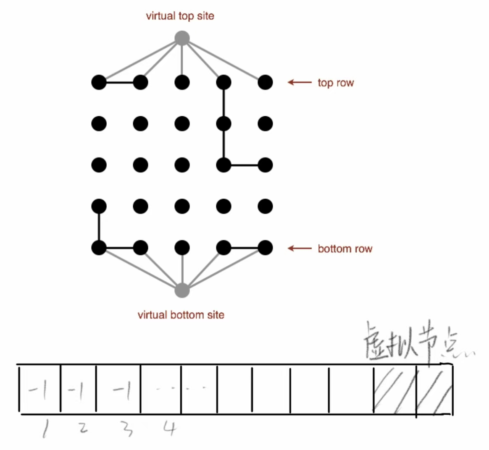

```java
Node[][] arr = new Node[][]{new Node[N]};
```
代码尝试创建一个二维的`Node`类型数组，但成为一个 **长度为 1 的二维数组**。

* `new Node[][]{...}` 是 Java 中「二维数组的初始化语法」，花括号内需要依次列出二维数组中**每一行对应的一维数组**。比如 `new Node[][]{new Node[3], new Node[3]}`，代表创建一个 2 行 3 列的二维数组（花括号内 2 个一维数组，对应 2 行）。

但原代码里，花括号内**只写了 1 个一维数组 `new Node[N]`**，相当于只给二维数组初始化了「1 行」，而非预期的「N 行」。


```java
Node[][] arr = new Node[N][];  // 创建了一个长度为N的二维数组，但每行都是null
for (Node i[] : arr) {
    i = new Node[N];  // 这里的赋值不会影响原数组
}
```
**增强 for 循环的局限性**：
    - 增强 for 循环中的变量`i`是数组元素的**临时副本**
    - 对`i`赋值`new Node[N]`只会修改这个副本，不会改变原数组`arr`中的元素
    - 循环结束后，`arr`的所有行依然是`null`

简单说，增强 for 循环适合**读取**数组元素，不适合**修改数组本身的结构**。如果要给数组的行分配新的空间，必须通过索引（如`arr[row]`）来操作原数组。


## 失败一

最开始的时候我尝试使用`open` 和 `full` 作为参数来标记每个位置的状态。从上至下的对每个元素检查他是否符合`饱和状态` 

```java
public class Percolation {  
    // TODO: Add any necessary instance variables.添加任何必要的实例变量  
    Node[][] arr;  
    int size;  
    int fullNum;  
  
    public Percolation(int N) {  
        // TODO: Fill in this constructor.填充这个构造函数  
        size = N;  
        fullNum = 0;  
        arr = new Node[N][];  
        for (int i = 0; i < N; i++) {  
            arr[i] = new Node[N];  
        }  
        for (int i = 0; i < size; i++) {  
            for (int j = 0; j < size; j++) {  
                arr[i][j] = new Node();  
            }  
        }  
    }
```

但是这种方法必然存在一定缺陷。从上至下的检索无法包含回转的余地。


后来我想到了并集。

## 成功二

把二维数组映射成一位数组，同时增设两个头尾虚拟节点，这样把原本判断渗流时该处理的多个点转换成两个点。

数组里存储的是自己的头节点或者整棵树的数量。

合并两个点，就是把这两个节点的根节点找到，并且按照优先级比较，优先级低的作为优先级高的树的子树。当整个系统渗流的表现就是虚拟节点都指向同一个根节点。

注意，不应该在刚开始的时候就把头牌和尾牌的节点都直接连接到虚拟节点。



**伪代码实现：**

```java

public class Percolation {  
    // TODO: Add any necessary instance variables.  
    int[][] arr;  
    int[] PerList;  
    int size;  
  
    public Percolation(int N) {  
        // TODO: Fill in this constructor.  
        arr = new int[N][N];  
        PerList = new int[N * N + 2];  
        size = N;  
        
        ···
        }  
  
    public void open(int row, int col) {  
        arr[row][col] = 0;  
        if (row == 0) { // 连接头部虚拟节点  
            ···
        if (row == (size - 1)) {  // 连接尾部虚拟节点 
            ···
        }  
	        ···
            union(row, col, row - 1, col); // 上 
            union(row, col, row + 1, col); // 下   
            union(row, col, row, col - 1); // 左   
            union(row, col, row, col + 1); // 右  
    }  
  
    public boolean isOpen(int row, int col) {  
        return arr[row][col] == 0;  
    }  
  
    public boolean isFull(int row, int col) {  
        if (checkIndexOutarr(row, col) && isOpen(row, col)) {  // 不越界且open
            int i = find(row, col);   // 判断是否连接虚拟头节点
            if (i == size * size) {  
                return true;  
            }  
        }  
        return false;  
    }  
  
    public int numberOfOpenSites() {  
        int total = 0;  
        // 遍历整个二维数组，调用isOpen（）
        ··· 
        return total;  
    }  
  
    public boolean percolates() {  
        return find(size * size) == find(size * size + 1);  
    }  
  
    public int nodeBeNum(int row, int col) {  
        return row * size + col;  
    }  
    public int[] numBeNode(int num) {  
	    // 一维数组索引转化为二维数组索引。
        ··· 
        return result;  
    }  
  
    public void union(int num1, int num2) {  
        if (checkIndexOutList(num1) && checkIndexOutList(num2)) {  
            ···
            // 与下面一致
        }  
    }  
    public void union(int row1, int col1, int row2, int col2) {  
        if (checkIndexOutarr(row1, col1) && checkIndexOutarr(row2, col2)) {  
            int n1 = find(row1, col1);  
            int n2 = find(row2, col2);  
            if (isVirtual(n1) && !isVirtual(n2)) {  // 先判断优先级高的虚拟头尾节点。
                PerList[n1] += PerList[n2];  
                PerList[n2] = n1;  
            } else if (!isVirtual(n1) && isVirtual(n2)) {  
                PerList[n2] += PerList[n1];  
                PerList[n1] = n2;  
            } else if (isVirtual(n1) && isVirtual(n2)) {  
                if (n1 == size * size && n1 != n2) {  // 
                    PerList[n1] += PerList[n2];  
                    PerList[n2] = n1;  
                } else if (n2 == size * size && n1 != n2) {  // n1就是尾节点
                    PerList[n2] += PerList[n1];  
                    PerList[n1] = n2;  
                }  
            } else if (-n1 > -n2) {  
                PerList[n1] += PerList[n2];  
                PerList[n2] = n1;  
            } else if (-n2 > -n1) {  
                    PerList[n2] += PerList[n1];  
                    PerList[n1] = n2;  
                }  
        }  
    }  
    public boolean isVirtual(int num) {  
        return num == size * size || num == size * size + 1;  
    }  
    public int find(int row, int col) {  
	    // 查找根节点
        ···  
    }  
    public  int find(int num) {  
	    // 查找根节点
        ···
    }  
  
    public boolean checkIndexOutarr(int row, int col) { 
	    // 检查越界
        return row >= 0 && col >= 0 && row < size && col < size;  
    }  
  
    public boolean checkIndexOutList(int num) {  
	    // 检查越界
        return num >= 0 && num < size * size + 2;  
    }  
}
```

## 回流现象


```java
} else if (isVirtual(n1) && isVirtual(n2)) {  
    if (n1 == size * size && n1 != n2) {  
        PerList[n1] += PerList[n2];  
        PerList[n2] = n1;  
    } else if (n2 == size * size && n1 != n2) {  
        PerList[n2] += PerList[n1];  
        PerList[n1] = n2;  
    }
```
判断渗流后直接把虚拟尾节点作为虚拟头节点的子树，会使得虚拟尾节点下的所有子树的根都变成虚拟头节点，即所有以虚拟尾接点相通的节点都是饱和的，导致回流。

**尝试只把虚拟尾节点下的某一分支作为虚拟头节点的子树。**

成功！


**成果展示：**


---

### 思考两个问题

1. 使用QuickFindUF中的快速查找算法实现渗透（Percolation）数据类型。使用秒表（Stopwatch）来测量不同N值和T值下PercolationStats的总运行时间。将N加倍会对总运行时间产生怎样的影响？将T加倍又会对总运行时间产生怎样的影响？
> 单次渗透模拟（N×N 网格）中，最坏情况下需执行 O (N²) 次`union`操作，每次`union`耗时 O (N)，故单次模拟时间复杂度为 O (N³)。
- 执行 T 次模拟的总时间复杂度为 O (T×N³)。
1. 现在，使用WeightedQuickUnionUF中的加权快速联合算法来实现渗透（Percolation）数据类型。回答前一小节中的相同问题。
>虚拟节点：引入两个虚拟节点 `top`（顶部）和 `bottom`（底部），分别连接所有顶部行的开放节点和底部行的开放节点。若 `top` 与 `bottom` 连通，则系统渗滤。